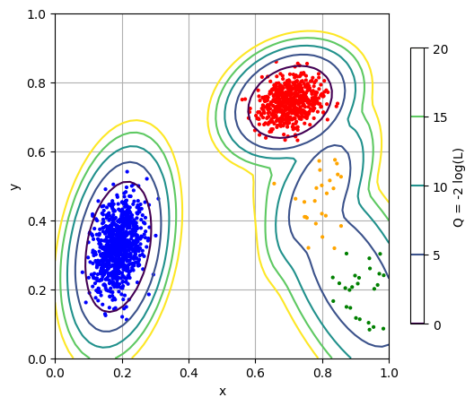

gmm
===================================================

This sprint is exploring fitting gaussian mixture models (GMM) using sklearn.

Ryan Reece  (<ryan.reece@cern.ch>)
Created: 2017-12-02

See also
---------------------------------------------------

-   <http://scikit-learn.org/stable/modules/outlier_detection.html>
-   <http://scikit-learn.org/stable/modules/generated/sklearn.mixture.GaussianMixture.html#sklearn.mixture.GaussianMixture>
-   <http://scikit-learn.org/stable/auto_examples/mixture/plot_gmm_pdf.html#sphx-glr-auto-examples-mixture-plot-gmm-pdf-py>
-   <http://scikit-learn.org/stable/auto_examples/covariance/plot_mahalanobis_distances.html#sphx-glr-auto-examples-covariance-plot-mahalanobis-distances-py>

